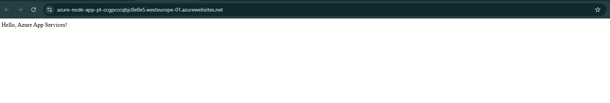
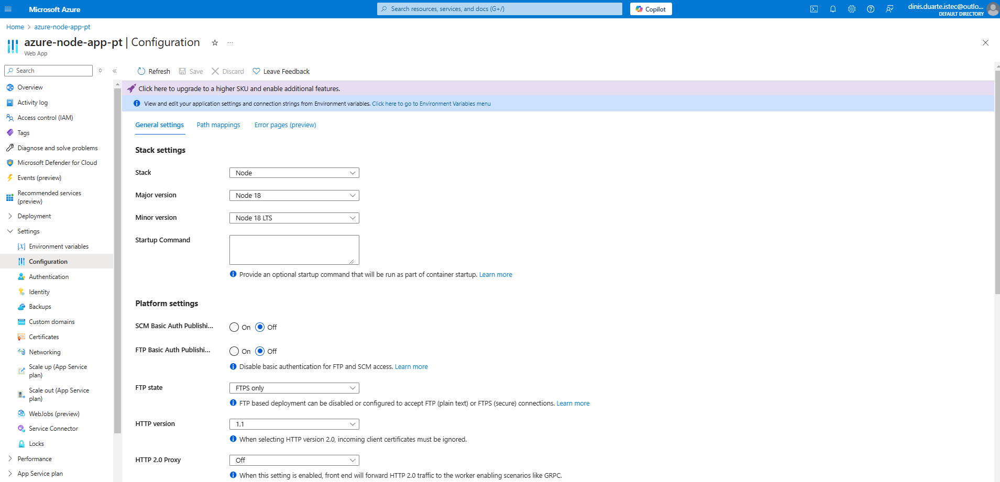
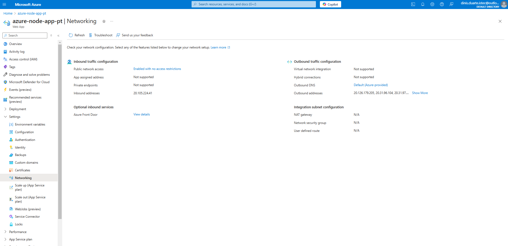
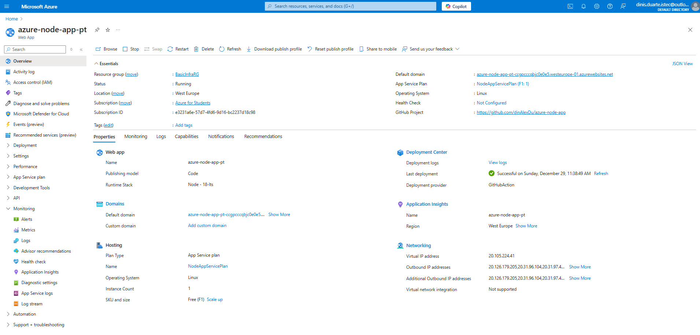
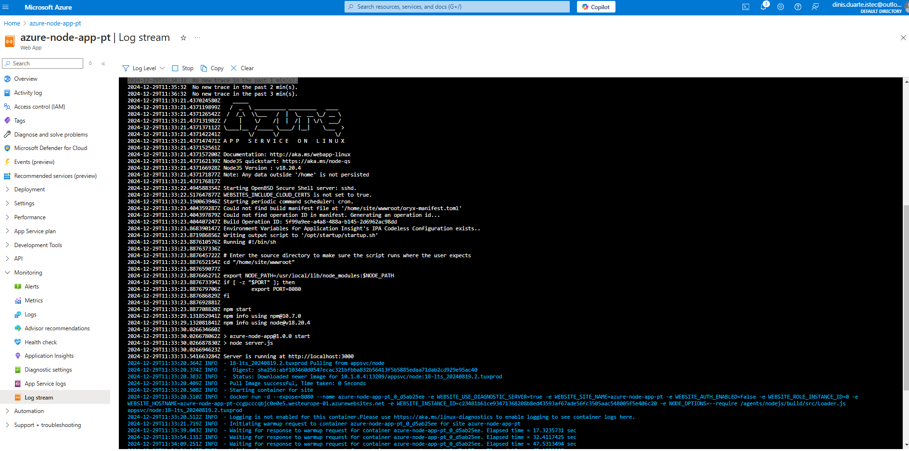
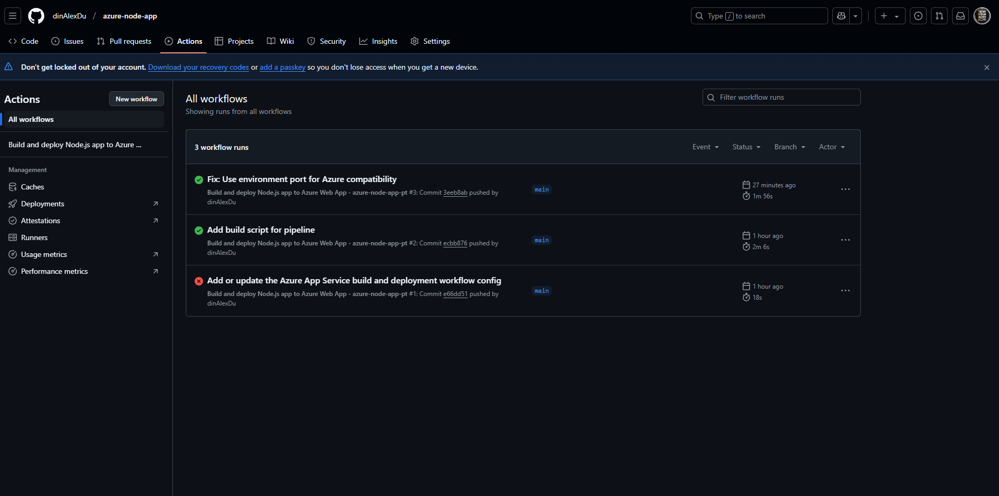
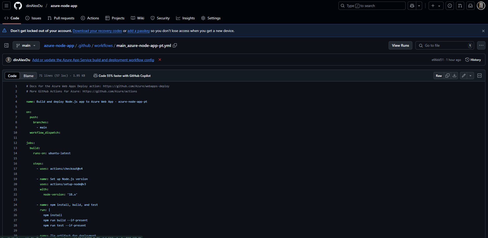
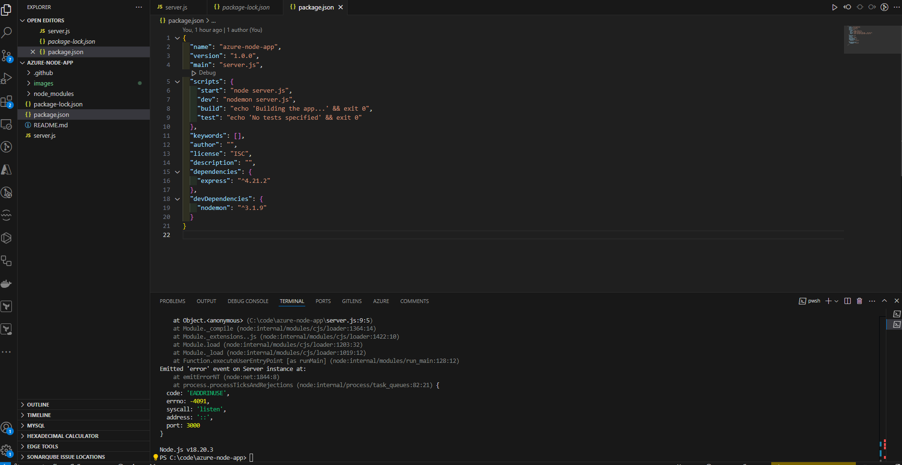

# Azure Node.js App Deployment

This project demonstrates how to deploy a simple Node.js application to **Azure App Services** using **GitHub Actions** for CI/CD.

## Application Overview

The application is a simple Express.js server that responds with:
```bash
Hello, Azure App Services!
```


## Screenshots

### 1. Application Running in Browser


### 2. Azure App Service Configuration


### 3. Azure Networking Configuration


### 4. Azure App Service Overview


### 5. Azure Log Stream


### 6. GitHub Actions Workflow Success


### 7. GitHub Actions Workflow Configuration


### 8. Project Structure and Fix in Visual Studio Code


---

## Steps to Reproduce

1. Clone this repository:
   ```bash
   git clone https://github.com/yourusername/azure-node-app.git
   cd azure-node-app
   ```

2. Install dependencies:
   ```bash
   npm install
   ```
3. Run locally:
   ```bash
    npm start
   ```
4.  Deploy to Azure:

- Follow the [Azure App Service Documentation](https://learn.microsoft.com/en-us/azure/app-service/) to set up your environment.


## Fixes Implemented

- Port Issue Fix: Adjusted the application to use the Azure-required environment variable PORT instead of a hardcoded port.
- Issue: Azure uses a dynamic port, and hardcoding the port caused deployment failures.
- Solution: Updated the application to read the PORT variable from the environment.

## Technologies Used

- Node.js (v18)
- Express.js
- GitHub Actions for CI/CD
- Azure App Services

## License
This project is licensed under the MIT License.


## Links
Azure App Service Documentation:
https://learn.microsoft.com/en-us/azure/app-service/

Express.js Documentation:
https://expressjs.com/

Node.js Documentation:
https://nodejs.org/en/


